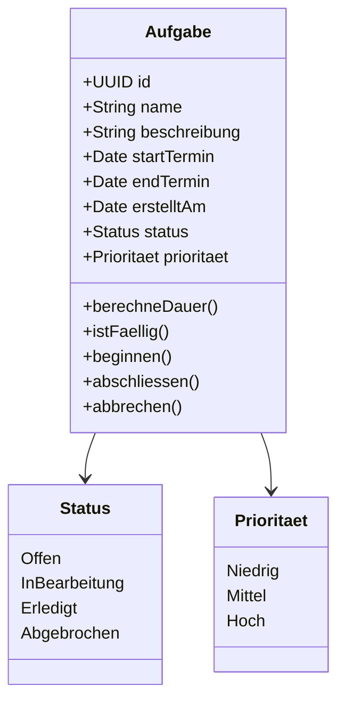
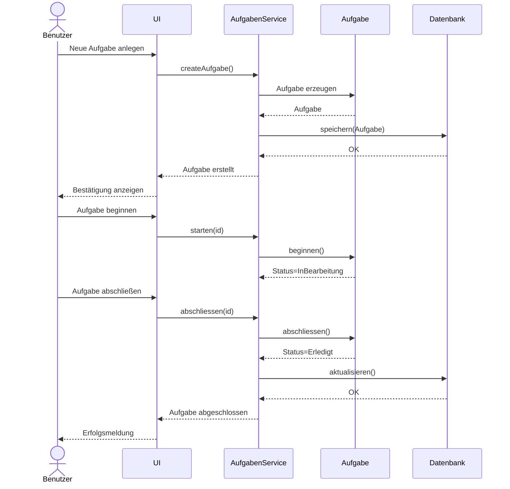
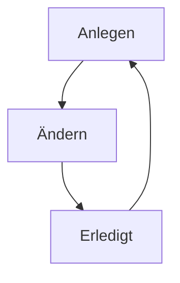

# Testdatei für mermaid-UML

# Beispiele
Generated with help of Copilot AI

## Klassendiagramm

```mermaid

classDiagram

class Aufgabe {
    +UUID id
    +String name
    +String beschreibung
    +Date startTermin
    +Date endTermin
    +Date erstelltAm
    +Status status
    +Prioritaet prioritaet

    +berechneDauer()
    +istFaellig()
    +beginnen()
    +abschliessen()
    +abbrechen()
}

class Status {
    Offen
    InBearbeitung
    Erledigt
    Abgebrochen
}

class Prioritaet {
    Niedrig
    Mittel
    Hoch
}

Aufgabe --> Status
Aufgabe --> Prioritaet
```
## Sequenzdiagramm

```mermaid
sequenceDiagram

actor Benutzer

participant UI
participant AufgabenService
participant Aufgabe
participant Datenbank

Benutzer->>UI: Neue Aufgabe anlegen
UI->>AufgabenService: createAufgabe()

AufgabenService->>Aufgabe: Aufgabe erzeugen
Aufgabe-->>AufgabenService: Aufgabe

AufgabenService->>Datenbank: speichern(Aufgabe)
Datenbank-->>AufgabenService: OK

AufgabenService-->>UI: Aufgabe erstellt
UI-->>Benutzer: Bestätigung anzeigen

Benutzer->>UI: Aufgabe beginnen
UI->>AufgabenService: starten(id)
AufgabenService->>Aufgabe: beginnen()

Aufgabe-->>AufgabenService: Status=InBearbeitung

Benutzer->>UI: Aufgabe abschließen
UI->>AufgabenService: abschliessen(id)

AufgabenService->>Aufgabe: abschliessen()
Aufgabe-->>AufgabenService: Status=Erledigt

AufgabenService->>Datenbank: aktualisieren()
Datenbank-->>AufgabenService: OK

AufgabenService-->>UI: Aufgabe abgeschlossen
UI-->>Benutzer: Erfolgsmeldung
```
## The task lifecycle - just for fun

```mermaid
  graph TD;
      Anlegen-->Ändern;
      Ändern-->Erledigt;
      Erledigt-->Anlegen;
```